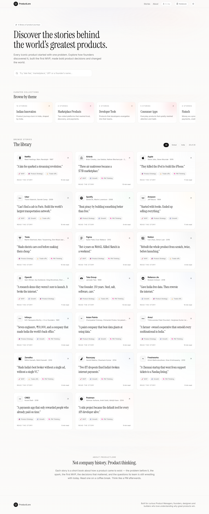
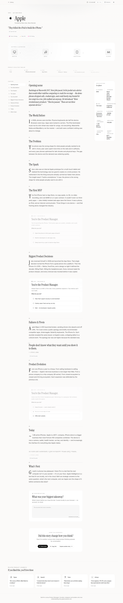
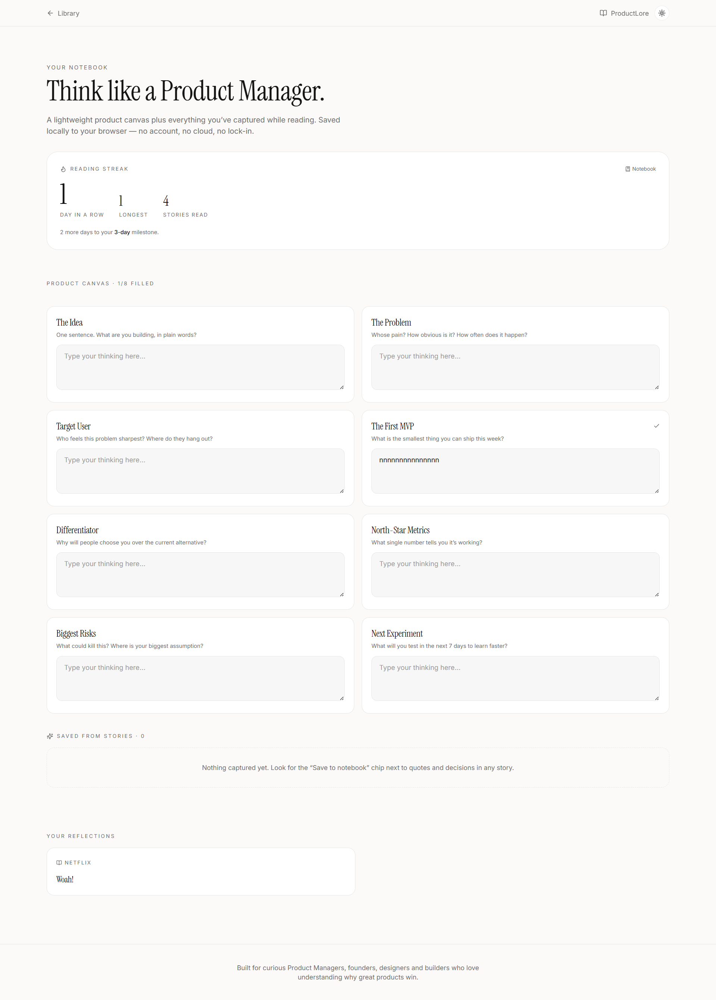

# 🚀 ProductLore

> Not company history. Product thinking.

ProductLore is an interactive storytelling platform that explores how some of the world's greatest products came to exist.

Instead of simply reading company histories, ProductLore lets readers experience the product journey — from the original problem and first MVP to the product decisions, failures, pivots, and choices that shaped what the product became.

**🌐 Live Demo:** [https://productlore.vercel.app](https://productlore.vercel.app)

---

# The Problem

We often study successful products only after they have already won.

We know what Netflix, Airbnb, Apple, Tesla, or Zerodha became.

But understanding their success requires something more than knowing the final outcome.

Product Managers, aspiring PMs, founders, and builders need to understand:

- What problem existed before the product?
- How did the founders identify the opportunity?
- What did the first MVP look like?
- Which product decisions changed the trajectory?
- What failures and pivots shaped the product?
- What would you have done if you were the Product Manager?

Most company histories answer the first few questions.

Very few let you **experience the decisions yourself.**

---

# Solution

ProductLore turns product journeys into short, interactive stories.

Readers can:

- Explore cinematic product stories
- Understand the problem behind the product
- Follow the evolution from MVP to today's product
- Make important product decisions at key moments
- Compare their decisions with what the real team did
- Capture their own product ideas and learnings in a Product Notebook

The goal is simple:

**Don't just learn what happened. Think through why it happened.**

---

# Key Features

✅ Interactive product stories

✅ Cinematic storytelling

✅ Product evolution timelines

✅ Historical Product Manager decision challenges

✅ "You're the Product Manager" interactive scenarios

✅ Product Notebook for capturing ideas and learnings

✅ Reading streaks

✅ Curated product collections

✅ Global and Indian product stories

✅ Light / Dark mode

✅ Responsive reading experience

---

# Product Workflow

Product Story
│
▼
Problem & Context
│
▼
Product Journey
│
▼
Key Product Decision
│
▼
Reader Makes a Decision
│
▼
What Actually Happened?
│
▼
Product Evolution
│
▼
Reader Reflection
│
▼
Product Notebook

---

# Screenshots

## Product Library

Explore product journeys across global and Indian companies.

---

## Interactive Product Story

Follow a product's journey and step into important decisions faced by the team.

---

## Product Notebook

Capture product ideas, problems, MVPs, differentiators, metrics, risks, and experiments while learning.

---

# Product Stories

ProductLore currently features stories across global and Indian companies.

## Global Products

- Netflix
- Airbnb
- Apple
- Uber
- Spotify
- Amazon
- Tesla
- Figma
- Notion
- OpenAI

## Indian Products & Companies

- Tata Group
- Reliance Jio
- Infosys
- Asian Paints
- Amul
- Zerodha
- Razorpay
- Freshworks
- CRED
- Postman

---

# Product Thinking

ProductLore is built around a simple idea:

> **Understanding why a product won is more useful than simply knowing that it won.**

Traditional company histories tell us what happened.

ProductLore asks the reader to think:

- Would you have launched the MVP?
- Which feature would you prioritize?
- Would you pivot or continue?
- When would you invest in a new market?
- Would you take the same risk?
- What would you build next?

The reader makes a decision first and then discovers what the real team did.

This transforms passive reading into active product thinking.

---

# Product Notebook

ProductLore includes a lightweight personal Product Notebook.

Readers can capture:

- Product Ideas
- Problems
- Target Users
- MVP
- Differentiators
- North-Star Metrics
- Risks
- Next Experiments
- Reflections and Learnings

The notebook currently uses local browser storage, so no account or login is required.

---

# Tech Stack

- Next.js
- React
- TypeScript
- Tailwind CSS
- Local Browser Storage
- Vercel

---

# Future Roadmap

The current version focuses on interactive product storytelling and individual product thinking.

Future versions can explore:

- More product stories
- Interactive product simulations
- Product comparisons
- Community product challenges
- AI-powered product coaching
- Product case-study practice
- Product idea development
- Collaborative Product Notebooks
- User accounts and cloud synchronization

---

# Why I Built This

As a Product Manager, I have always found it more interesting to understand **why** a product succeeded than simply reading about its success.

When we look at products like Netflix, Airbnb, or Apple today, the outcome feels obvious.

It wasn't obvious when the decisions were being made.

ProductLore was built to recreate some of that uncertainty.

Instead of telling you:

> "This is what Netflix did."

ProductLore asks:

> **"You're the Product Manager. What would you do?"**

Then it shows you what actually happened.

The goal is to help aspiring Product Managers, founders, designers, and builders develop better product intuition by learning from the decisions behind products that changed their markets.

---

# Live Demo

**🌐 [Visit ProductLore](https://productlore.vercel.app)**

---

# Project Status

**Version 1.0 — Live**

ProductLore is currently a live, evolving product. Future development will be guided by real user behaviour and feedback.

---

# Author

**Alokik Sinha**

Product Manager | Product & AI Builder

GitHub: [https://github.com/AlokikKS](https://github.com/AlokikKS)
